<h1 align="center"> DATA SCIENCE</h1>

<h2 align="center" id="0_1">Banco de dados e Linguagem SQL e NoSQL</h2>

 

### SUMÁRIO

- [Introdução SQL](#1)
- [Conceitos gerais](#2)
- [Modelo Clássico](#3)
- [PMO](#4)
- [Mentalidade e princípios Ágeis](#5)
- [Doze princípios Ágeis](#6)
- [Metodologias Ágeis](#7)
- [Conclusão](#8)
- [Referência](#9)

 
<h1 align="center" id="1">INTRODUÇÃO</h1>
 

<h3 align="center" >Projetos clássicos</h3>

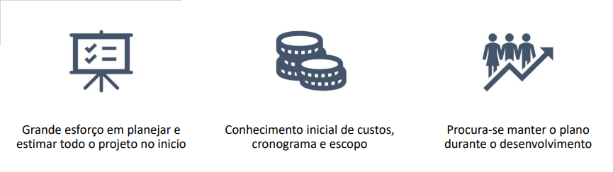
 

<h3 align="center" >Projetos Ágeis</h3>

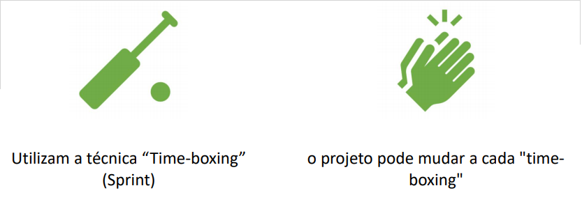
 

 
<h1 align="center" id="2">CONCEITOS GERAIS</h1>
 

**O que é um Projeto:**

 - “É um esforço Temporário empreendido para criar um produto, serviço ou resultado exclusivo.” *PMBOK*
   - Temporário: Todos os projetos possuem um início e um final definidos.
   - Produtos, Serviços ou resultados exclusivos: Um projeto cria entregas exclusivas, que são produtos, serviços ou resultados.

**EXEMPLOS DE PROJETOS:**
 - Construção de uma casa
 - Redação de um livro
 - Lançamento de um produto ou serviço
 - Realização de uma viagem
 - Desenvolvimento de um software

**EXEMPLOS DE "NÃO PROJETOS":**
 - Compra de materiais
 - Fabricação de carros
 - Gerenciamento de um setor administrativo
 - Venda de produtos ou serviços
 - Pagamento de produtos ou serviços

 
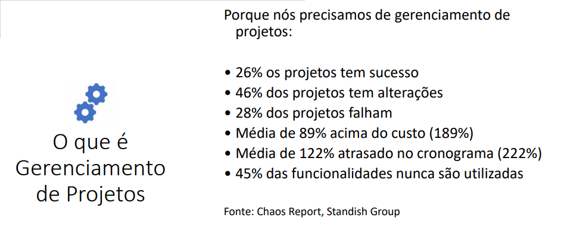
 

 
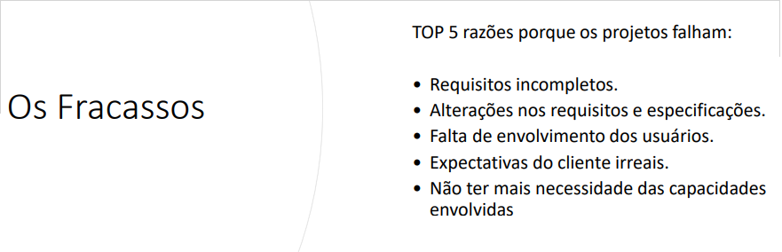
 

 
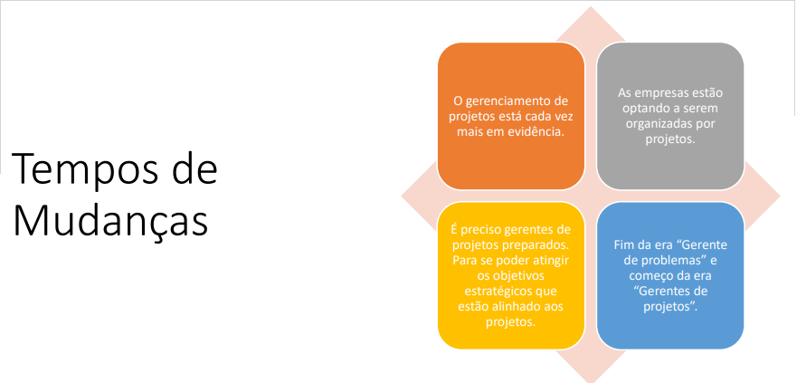
 

 
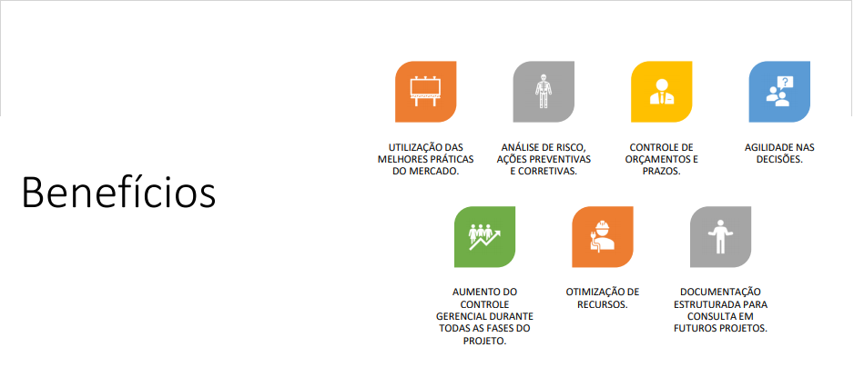
 

 
<h1 align="center" id="3">MODELO CLÁSSICO</h1>
 

<h2 align="center" >Fluxo resumido de processos do gerenciamento de projetos</h2>
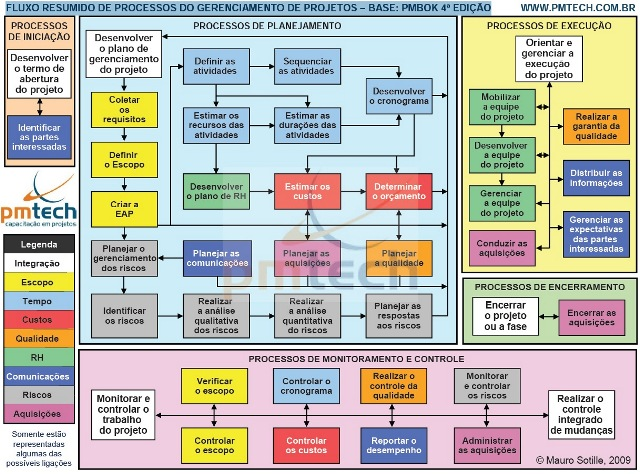
 

**CICLO DE VIDA:**
 - 1. Requisitos
 - 2. Análise
 - 3. Projeto
 - 4. Implementação
 - 5. Testes

 
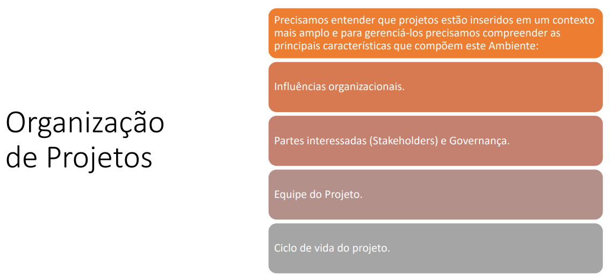
 

**INFLUÊNCIAS ORGANIZACIONAIS:**
 - Os projetos geralmente fazem parte de uma organização, que é maior que o projeto.
 - Empresas, organizações governamentais, instituições de saúde, organismos internacionais, etc...
 - A maturidade da organização em relação ao gerenciamento de projetos, vai influenciar diretamente a atuação do gerente de projeto.

**ESTRUTURA ORGANIZACIONAL:**
 - O tipo da estrutura da organização está diretamente ligado a disponibilidade de recursos para execução do projeto.
 - As estruturas vão desde funcionais até projetizadas, tendo como intermediárias as estruturas chamadas de matriciais.

<h3 align="center">STAKEHOLDERS DO PROJETO</h3>
 - São pessoas ou organizações ativamente envolvidas no projeto e que são afetadas pelos resultados do projeto.
 - Influenciam os objetivos do projeto.
 - É preciso identificar os stakeholders, determinar suas expectativas e necessidades, a fim de influenciá-los para não ter impactos nos requisitos do projeto.

**QUEM SÃO?**
 - Clientes/Usuários
 - Patrocinador/Sponsor
 - Gerente de Portfólio/Comitê de Revisão de Portfólio
 - Gerentes de programas
 - Escritório de Gerenciamento de Projetos
 - Gerente de Projetos
 - Time de Projeto
 - Gerentes Funcionais
 - Gerenciamento Operacional
 - Vendedores, Parceiros de Negócios

**STAKEHOLDERS DE PROJETO DE CIÊNCIA DE DADOS:**
 - Funcionários
 - Clientes
 - Fornecedores
 - Recursos humanos
 - Concorrentes
 - Investidores
 - Imprensa

**SUCESSO DO PROJETO:**
 - Cumprir os objetivos dentro das restrições do projeto (Como definidas nas linhas de base)
   - Escopo
   - Tempo
   - Custo
   - Qualidade
   - Recursos
   - Riscos

<h3 align="center">CICLO DE VIDA DO PROJETO</h3>
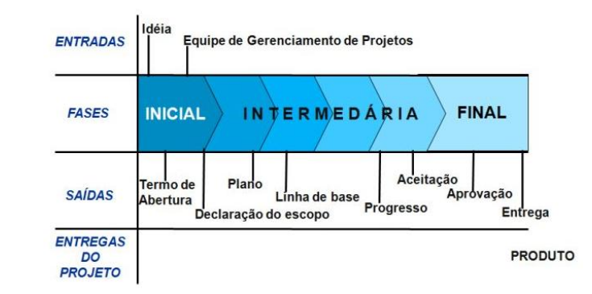
 

<h3 align="center">CARACTERÍSTICAS DO CICLO DE VIDA DO PROJETO</h3>
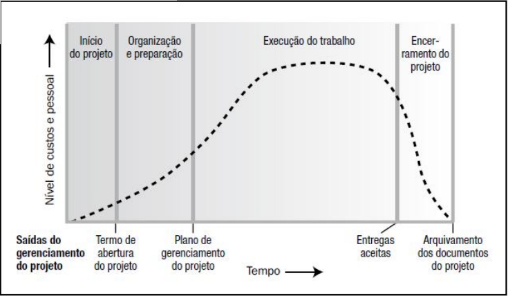
 

<h3 align="center">INFLUÊNCIAS X CUSTO DAS MUDANÇAS</h3>
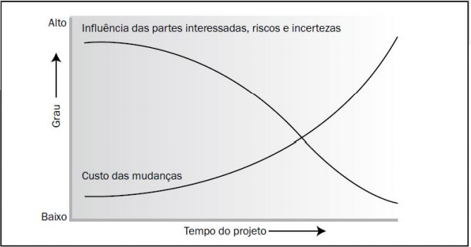
 

 
<h1 align="center" id="4">PMO</h1>
 

*“Uma das formas mais utilizadas para aumentar a maturidade em gerenciamento de projetos nos tempos atuais tem sido a formalização da implantação de escritório de projetos nas organizações”* Quelhas e Barcauí, 2003

**O QUE É:**
 - Grupo de indivíduos autorizados a falar por um projeto (Cleland, 1999);
 - Meio de promover a cultura de gerenciamento de projetos sob a perspectiva de melhoria de métodos e processos (Frame, 1998).
- Uma unidade da organização que centraliza e coordena, ou supervisiona, o gerenciamento de projetos e/ou programas. 

**ESTRUTURA:**
 - Para ter sucesso, o PMO deve ser adequado aos tipos de projetos da organização, sua capacidade de gerenciar projetos, a capacidade de seus recursos e sua cultura organizacional

**TIPOS:**
 - SUPORTE: Prove suporte nas áreas de conhecimento, modelos, melhores práticas, acesso a informação
 - CONTROLE: Também faz revisões, auditorias etc.
 - DIRETIVO: Aloca apenas GP profissionais. Alto nível de consistência entre os projetos, que se reportam ao PMO

<h3 align="center">VANTAGENS</h3>
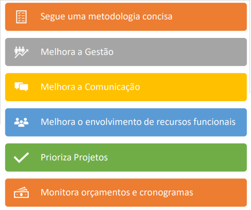
 

 - Melhor transição para operações
 - Valorização dos profissionais
 - Processo de aprovação formal
 - Prove estrutura e expertise para melhorar o sucesso de projetos
 - Padroniza o Processo de Projetos

**VANTAGENS:**
 - Metodologia
 - Processos
 - Ferramentas
 - Relatórios
 - Treinamento
 - Melhores práticas
 - Serviços de GP
 - Melhoria contínua

 
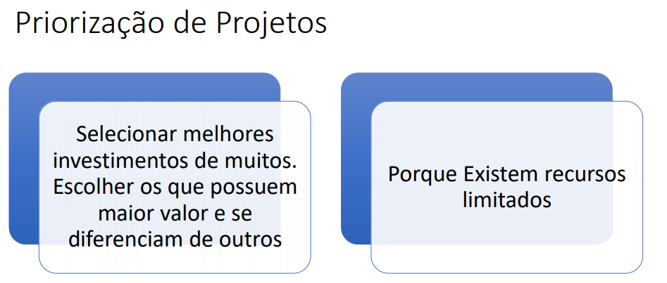
 

 
<h1 align="center" id="5">MENTALIDADE E PRINCÍPIOS ÁGEIS</h1>
 

**DESENVOLVIMENTO ÁGIL DE SOFTWARE:**
 - Oposição ao Método em Cascata
 - Adaptativo
 - Curtos períodos – Iteração/Sprints
 - Comunicação em tempo real e face a face
 - Menos documentação
 - Equipe horizontal, sem Gerente de Projeto formal
 - Consenso de equipe ao invés de autoridade

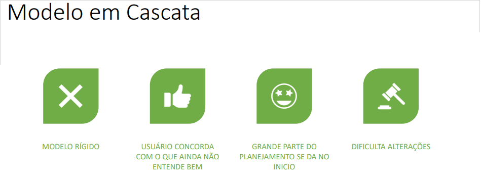
 

**Manifesto for Agile Software Development:**
*“Estamos descobrindo maneiras melhores de desenvolver software, fazendo-o nós mesmos e ajudando outros a fazerem o mesmo. Através deste trabalho, passamos a valorizar:“*
 - Fevereiro de 2001
 - [Link](http://agilemanifesto.org/)
 - Manifesto + Princípios

**MANIFESTO PARA DESENVOLVIMENTO ÁGIL DE SOFTWARE**

 - **Indivíduos e interações** mais que (Processos e ferramentas)
 - **Software em funcionamento** mais que (Documentação abrangente)
 - **Colaboração com o cliente** mais que (Negociação de contratos)
 - **Responder a mudanças** mais que (Seguir um plano)

**Indivíduos e Interações mais que Processos e Ferramentas:**
 - Processos e Ferramentas são importantes, porém...
 - Projetos são desenvolvidos e aceitos por pessoas
 - Desde o inicio focar em pessoas
 - Problemas são resolvidos por pessoas

**Software em Funcionamento mais que Documentação Abrangente:**
 - O objetivo principal dos projetos é criar software que funcione
 - Software precisa de documentação, porém é melhor software com menos documento do que mais documento sem software
 - Muita documentação não agrega valor ao produto
 - Alguns documentos jamais servem para alguma coisa

**Colaboração com o Cliente mais que Negociação de Contratos:**
 - Reconhecer desde o inicio que o projeto vai mudar
 - Aceitar mudança 
 - Ser flexível ao invés de seguir até o fim o que foi determinado no inicio
 - Relação de confiança

**Responder a Mudanças mais que Seguir um Plano:**
 - Reconhecer que quando se planejou, sabia-se menos sobre o projeto
 - Investir mais em adequar a mudança do que evita-la ou tentar trazer o projeto de volta ao plano inicial

 
<h1 align="center" id="6">DOZE PRINCÍPIOS ÁGEIS</h1>
 

1. Satisfação do Cliente com Bom Software
2. Mudanças são Bem-Vindas
3. Entregas Frequentes
4. Trabalhe com Pessoas de Negócio
5. Motive as Pessoas
6. Conversa Face a Face
7. Meça Software Pronto
8. Mantenha um Ritmo Constante
9. Mantenha Excelência Técnica e Design
10. Mantenha Simples
11. Equipes Criam Arquitetura
12. Refletir e Ajustar

**1. SATISFAÇÃO DO CLIENTE COM BOM SOFTWARE**
Nossa maior prioridade é satisfazer o cliente através da entrega contínua e adiantada de software com valor agregado.

 - Satisfazer o cliente
 - Entregar cedo
 - Entregar continuamente
 - Entrega software de valor mais do que documentos

 

**2. MUDANÇAS SÃO BEM-VINDAS**
Mudanças nos requisitos são bem-vindas, mesmo tardiamente no desenvolvimento. Processos ágeis tiram vantagem das mudanças visando vantagem competitiva para o cliente.

 - Mudança é bem vinda
 - Desde o inicio o projeto deve ser adaptado para a mudança
 - Não é considerada quebra de escopo
 - Em vez de processos engessados de mudanças, elas são priorizadas no backlog do produto

 

**3. ENTREGAS FREQUENTES**
Entregar frequentemente software funcionando, de poucas semanas a poucos meses, com preferência à menor escala de tempo.
 - Entregas frequentes, para obter feedback: seguir com o plano ou altera-lo?
 - Entregas tardias podem ser “tarde demais"

 

**4. TRABALHE COM PESSOAS DE NEGÓCIO**
Pessoas de negócio e desenvolvedores devem trabalhar diariamente em conjunto por todo o projeto.
 - Envolvimento maior
 - Maior entendimento do produto
 - Chance de propor soluções ou alternativas
 - Se não for possível diariamente, a interação deve ser regulares

 

**5. MOTIVE AS PESSOAS**
Construa projetos em torno de indivíduos motivados. Dê a eles o ambiente e o suporte necessário
 - Pessoas motivadas podem fazer a diferença no projeto
 - Autonomia
 - Colaboração

 

**6. CONVERSA FACE A FACE**
O método mais eficiente e eficaz de transmitir informações para e entre uma equipe de desenvolvimento é através de conversa face a face.
 - Documentação escrita requer tempo e não prove interatividade
 - Comunicação face a face permite linguagem não verbal
 - Não substitui a comunicação escrita

**7. MEÇA SOFTWARE PRONTO**
Software funcionando é a medida primária de progresso.

 - Criar software é atividade principal
 - Criação de documentos é atividade de suporte
 - Aceitação e funcionamento em vez de desenvolvimento completo
 - Além de prazo, custo e tempo, software de valor e funcionando

 

**8. MANTENHA UM RITMO CONSTANTE**
Os processos ágeis promovem desenvolvimento sustentável. Os patrocinadores,
desenvolvedores e usuários devem ser capazes de manter um ritmo constante
indefinidamente.
 - Equilíbrio entre trabalho e vida pessoal
 - Em vez de longos períodos de desenvolvimento, manter um ritmo constante

 

**9. MANTENHA EXCELÊNCIA TÉCNICA E DESIGN**
Contínua atenção à excelência técnica e bom design aumenta a agilidade.
 - Design claro e aberto a mudanças.
 - Refatoração. 

 

**10. MANTENHA SIMPLES**
**Simplicidade** - a arte de maximizar a quantidade de trabalho não realizado - é essencial.
 - 64% das funcionalidades de um software são raramente ou nunca usadas*
 - Construir o que é essencial primeiro

 

**11. EQUIPES CRIAM ARQUITETURA**
As melhores arquiteturas, requisitos e designs emergem de equipes auto
organizáveis.
 - Para obter o melhor da equipe, deve-se dar oportunidade para que elas se organizem
 - Autonomia

 

**12. REFLETIR E AJUSTAR**
Em intervalos regulares, a equipe reflete sobre como se tornar mais eficaz e então refina e ajusta seu comportamento de acordo.
 - Coletar lições aprendidas ao final do projeto é tarde demais
 - Coletar e agir ao longo do projeto
 - Retrospectivas: ao final de cada iteração

 
<h1 align="center" id="7">METODOLOGIAS ÁGEIS</h1>
 

<h3 align="center">METODOLOGIAS</h3>
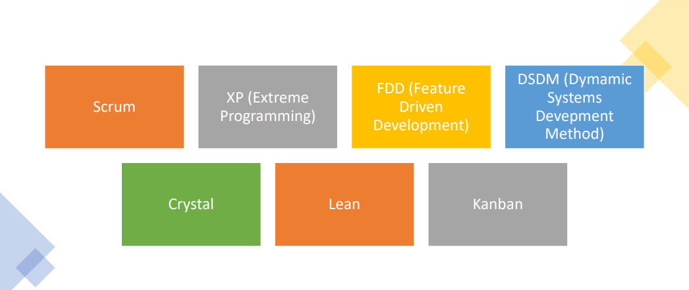
 

<h3 align="center">SCRUM - PILARES</h3>
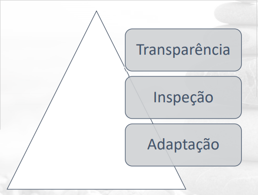
 

**SCRUM - EQUIPE:**
 - **Desenvolvedores:** Constroem o produto. Incentivados a gerenciar o próprio trabalho. Equipes auto organizadas.
 - **Dono do Produto:** Maximizar o valor do produto. Gestão do backlog
 - **Scrum Master:** Líder servidor da equipe de desenvolvimento. Facilitador. Comunicação.

 

**SCRUM - EVENTOS:**
 - Sprints (30 dias – máximo)
 - Sprint Planning Meeting (8 horas) 
 - Daily Scrum (15 min)
 - Sprint Review (4 horas)
 - Sprint Retrospective

 

**Sprint:**
 - Mini-projeto
 - Iteração de um mês ou menos
 - Cria um entregável
 - Inclui:
   - Desenvolvimento
   - Planning Meeting
   - Daily Scrum
   - Sprint Review
   - Sprint Retrospective

 

**Sprint Planning Meeting:**
 - O que vai ser entregue na Sprint?
 - É apresentado o Backlog pelo dono do produto
 - A equipe debate o entendimento do projeto, como vai ser construído e prevê o que pode ser entregue.

<h3 align="center">DAILY SCRUM</h3>
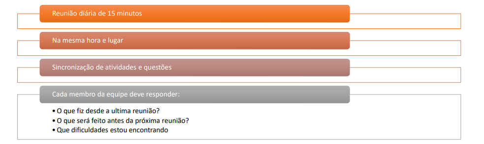
 

**SPRINT REVIEW**
 - Executada ao final da Sprint.
 - Mostrar o que foi feito.
 - Resposta a perguntas.
 - O dono do produto decide o que está pronto ou não e discute com a equipe o backlog restante com relação ao que deve ou não ser feito.

**SPRINT RETROSPECTIVE:**
 - Também ao final da Sprint e antes da próxima
 - Identifica o que deu certo
 - Busca oportunidades de melhoria
 - Foco em pessoas, relacionamento, processos e ferramentas

**SCRUM - ARTEFATOS:**
 - Product Backlog
 - Sprint Backlog
 - Definition of Done

**PRODUCT BACKLOG:**
 - Lista ordenada por prioridade de tudo o que deve ser feito para o produto, com funcionalidades, requisitos funcionais e não funcionais, melhorias, correções
 - Inclui estimativas
 - Itens mais prioritários devem estar mais detalhados

**SPRINT BACKLOG:**
 - Itens do product backlog que vão ser desenvolvidos na sprint
 - Deve conter um plano de como o objetivo vai ser alcançado

**DEFINITION OF DONE (DoD)**
 -  Para não haver dúvida, a equipe deve concordar com o significado de “pronto”,
ou seja, qual é objetivo que deve ser alcançado para algo estar pronto.

<h3 align="center">SCRUM: PROCESSOS</h3>
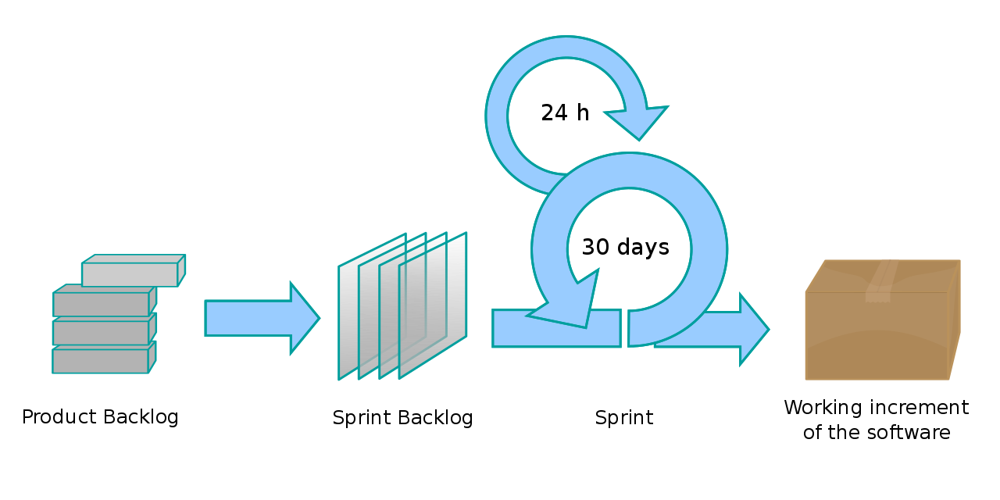
 
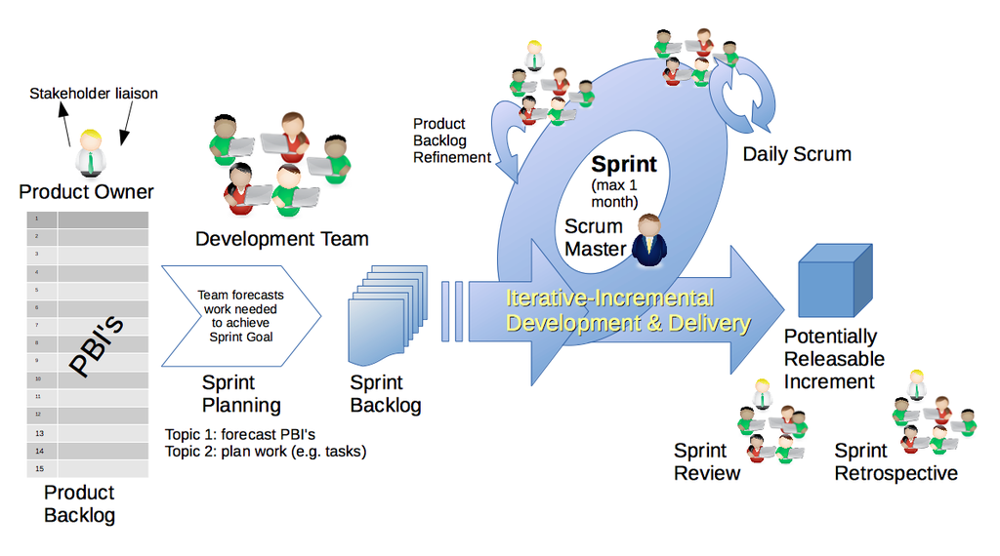
 

 
<h1 align="center" id="8">CONCLUSÃO</h1>
 

**Ágil, mais Adequado para:**
 - Projetos pequenos, no máximo com 20 desenvolvedores
 - Apoio da organização
 - Comunicação facilitada
 - Baixa criticidade
 - Mudanças frequentes de requisitos

**Não Adequado para:**
 - Grande número de desenvolvedores
 - Equipe alocada em diferentes locais
 - Alta criticidade
 - Cultura organizacional
 - Questões legais

 
<h1 align="center" id="9">REFERÊNCIAS</h1>
 

Livro: *BIG DATA uma visão diferencial*
[Link](https://1drv.ms/b/s!Am4PqLFJZ2-ai55VLNJqzgPDzz3oLw?e=mXmYnu)
